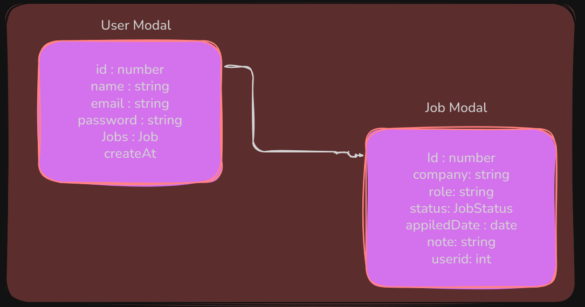

# Job Application Tracker (JAT)

Job Application Tracker is a web-based application designed to streamline and simplify the job search process for candidates. It gives users a centralized platform to track their job applications, manage statuses, and stay organized throughout their job-hunting journey.


## Authors

- [Md Khalid Alam](https://github.com/alammd0?tab=repositories)


## Tech Stack

**Client:** React.js(with Typescript), Redux Toolkit, React Router Dom, React Toastify, Tailwind CSS, Axios for API Request, React Icons

**Server:** Node with Express.js, JavaScript, JWT, ZoD, Nodemailer. Bcrypt

**Database:** Postgres, ORM


## API Reference

#### Post API

```http
  POST /api/v1/auth/signup
  POST /api/v1/auth/login
  POST /api/v1/job/create
```

#### Get API

```http
  GET /api/v1/auth/ger-user/{id}
  GET /api/v1/job/update-job/{id}
  GET /api/v1/job/get-all-jobs
```

#### Delete API

```http
  DELETE /api/v1/auth/delete-user/{id}
  DELETE /api/v1/job/delete-job/{id}
```

#### Update API

```http
  PUT /api/v1/job/update-job/{id}
```


## Screenshots





## Environment Variables

To run this project, you will need to add the following environment variables to your .env file

`DATABASE_URL=""` add your own DATABASE_URL

`JWT_SECRET= "khalid"`

`NODE_ENV= production`

`PORT = 3000`

`HOST_NAME = smtp.gmail.com`

`MAIL_USER = mdkhalidalam001@gmail.com`

`MAIL_PASS = ` find your password add here
## Run Locally

Clone the project

```bash
  https://github.com/alammd0/job-application-tracker.git
```

Go to the project directory

```bash
  cd job-application-tracker
```

Install dependencies

```bash
  npm install
```

Generate Prisma Client and Apply Migrations
```bash
cd backend 
npx prisma generate
npx prisma migrate dev --name init
```

Start the backend

```bash
  cd backend
  npm run start
```

Start the frontend

```bash
  cd frontend
  npm run start
```

## Demo

[Backend](https://job-application-tracker-ok5a.onrender.com) [Live](https://jta-ebon-nine.vercel.app/) [Video](https://youtu.be/6dWMFHT0S9c)

```bash
  npm run test
```


## Documentation

[Documentation](https://docs.google.com/document/d/1T7XDZ9aTuMrEewkJQKqONFg5bxPEkqmqpJVPY8OZeT0/edit?usp=sharing)